# Hero's Of Nazuma

# 1.Contexte 

### Genre : Rpg/Stratégie tour par tour

### Résumé : Jeu de stratégie en tour par tout dans un monde magique ou deux empires se s'apprête à livrer leur ultime bataille.

###  Objectif : l'objectif du jeu est d'utiliser plusieurs stratégie pour vaincre tout vos enemies. Les joueurs doivent être libre de choisir toute sorte de stratégie aussi génial que bordelique pour gagner.

# 2.Description de l’histoire (Lore)

### Intrigue : Quels sont les événements principaux du scénario ?

Dans un monde lointain ou deux empires lutte pour changer le monde entier à leur façon, l'empire Danma qui veut faire régner le monde par l'ordre et la discipline et à l'oposée l'empire Amnésia qui veut faire régner le monde par l'auto justice et le libre arbitre de chacun, le jour 36 du calendrier de Gallaghante en l'an 850 après l'apocalypse de Miruku aura lieu l'ultim bataille entre les 2 empires et leurs armées pour décider enfin de qui va écrire l'histoire du monde et rentrée dans la légende.

## Personnages : 

>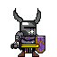   
>Niro Le chevalier
>
> Chevalier de l'ordre de Paladius et général de l'armée de Danma , Niro est prêt à voué son coeur et son épée à celle-ci au nom de la justice.

>| Statistiques   | Force | Vitalité | Vitesse | Protection |
>|----------------|-------|----------|---------|------------|
>| Niro           |   2   |    4     |    2    |     4      |
>

>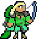   
>Nahida l'archere rebelle
>
> Une elfe des bois qui à étais acclamer en hêroine pour avoir empêcher de nombreux attentats contre l'empire, elle fait maintenant parti des forces d'information.

>| Statistiques   | Force | Vitalité | Vitesse | Protection |
>|----------------|-------|----------|---------|------------|
>| Nahida         |   4   |    3     |    3    |     2      |

>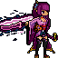   
> Acheron "Guerrière de l'éternité"
>
> Légende vivante connu de tous et celle que l'on considére de bien de nombreux titre , quiquonque s'attaquera à Danma se retrouvera sous le jugement divin de sa lame.

>| Statistiques   | Force | Vitalité | Vitesse | Protection |
>|----------------|-------|----------|---------|------------|
>| Acheron        |   5   |    2     |    4    |     1      |

>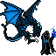   
>Ar'dahl le déchue
>
> Ancien mage de la garde royal du royaume d'Amnésia, il fut condamné à bruler dans le royaume des liches suite à l'arrivée du nouveau souverrain qui décima toute les personnes qui étais dévouée à l'ancien roi, celui-ci revient 12 ans après de la dimension et à rejoint l'armée de Danma pour sa quête de veangeance.

>| Statistiques   | Force | Vitalité | Vitesse | Protection |
>|----------------|-------|----------|---------|------------|
>| Ar'dahl        |   3   |    2     |    5    |     2      |

# 3. Mécaniques de jeu

## Gameplay principal : 
Le joueur sera sur une map générée avec des lieux aléatoire et pourra se déplacer sur la carte de bout en bout à chaque tour et peut accéder à son inventaire de potions ou autre.

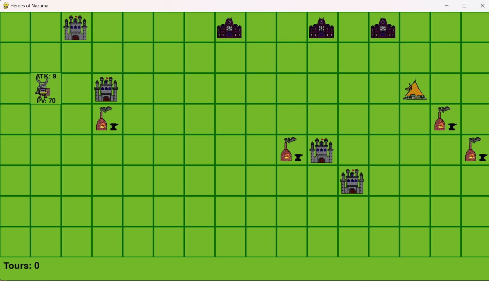

###### *"Exemple de la carte avec les lieux générée (sans enemies)"*

## Controle :

>|  Jeu           | Touche | 
>|----------------|--------|
>| Haut           |   ↑    |
>| Bas            |   ↓    |
>| Droite         |   →    |
>| Gauche         |   ←    |
>| Inventaire     |   E    |
>| Attaquer       |   A    |

## Règles :

*Comme tout Rgp/tactical le but du jeu est de vaincre tout les personnages enemies et la seule condition de défaite est si tout vos personnages périsse. Pour les systèmes de déplacement chaque case représente 1 de vitesse donc les personnages se déplace de case en case. Pour attaquer il faut être sur une case adjacante d'un enemie puis d'appuyer sur A pour lancer l'attaque (ce qui mettra fin au tour ).*

# 4.Graphismes et design

## Style artistique :
Pour le concept du jeu j'ai décider de faire du design 2D pour faire un jeu en vu de dessus.

## Personnages et environnement :
Pour les personnages et les lieux j'ai conceptuée tous les modéles en pixel art avec le logiciel LibreSprite.

## Ui/Ux :

Pour les menus j'ai choisis de faire un Ux desig asse simple dans l'ambiance du jeu tout en guidant les joueurs sur le menu.

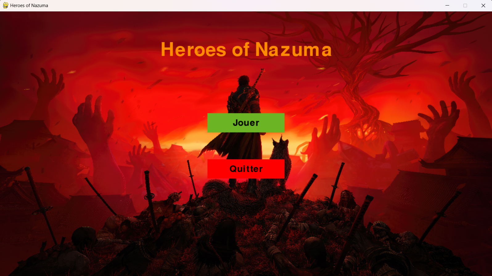

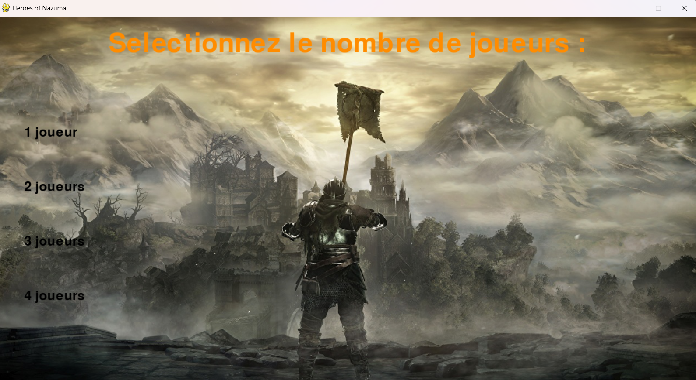

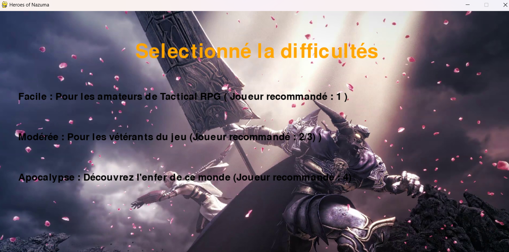

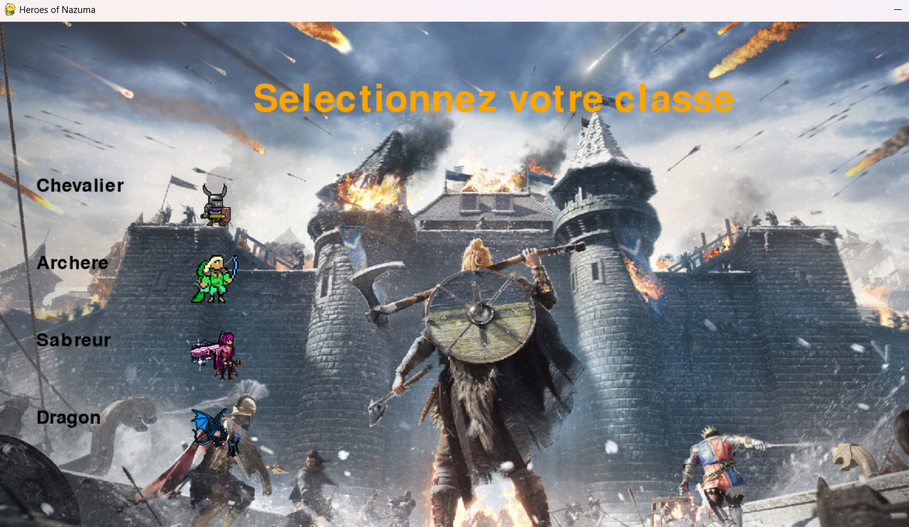

# 5. Son et musique

## Son d'ambiance :

Chauqe son d'ambiance pendant les combats ou le menu sont dans un style épic pour représenter la guerre et ont étais crée par moi en reprenant des bases d'autres musique déja existante.

[Musique du jeu](audio/GameSong.mp3)

[Musique du Menu](audio/MenuSong.mp3)

# 6. Test et rendu

# Exemple de parties :

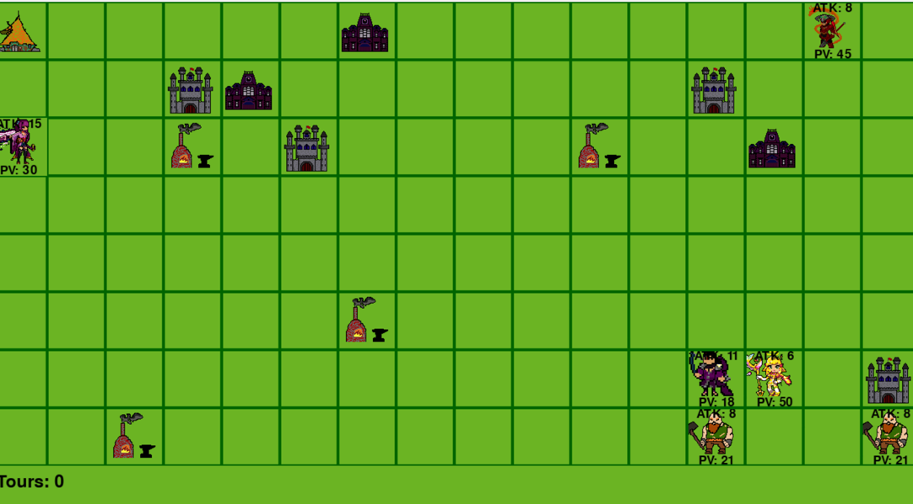

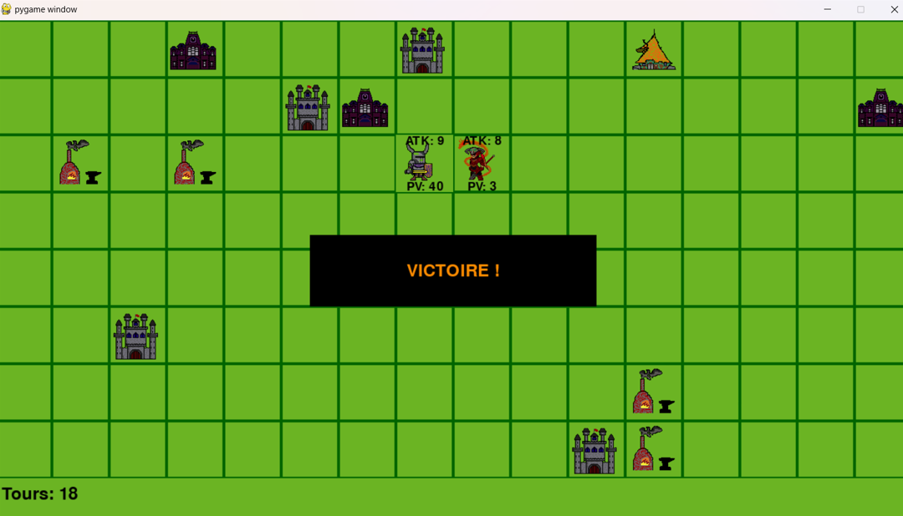

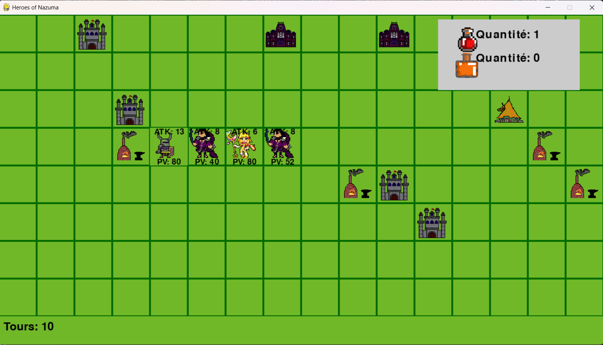

# 7. Test et rendu

Désormais vous savez tous sur le jeu son histoire ses mécanique et son design alors qu'attendez vous pour y jouer ^^ ?

[Trailer du jeu](https://youtu.be/C-gkeDV6K4E)
